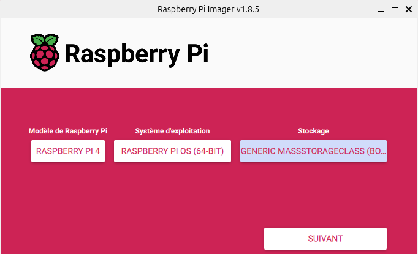
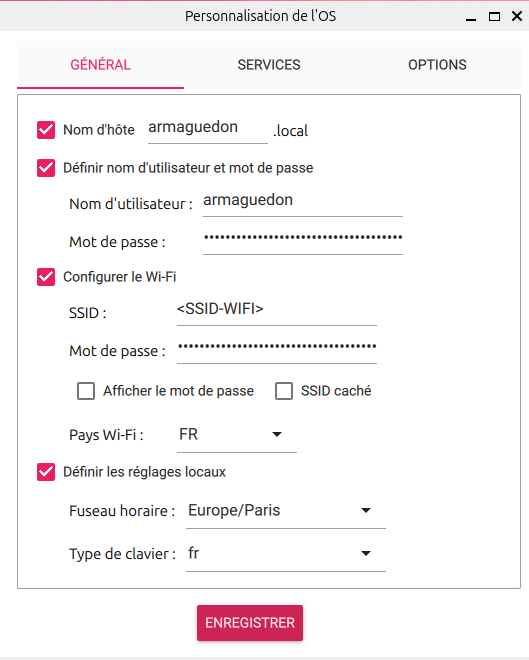

# Configuration OS Raspberry Pi 4 Model B

## Prérequis

* Carte MicroSD (minimum 16Go de stockage)
* Raspberry Pi 4 Model B 4Go RAM au minimum

## Étapes de mise en place

### Depuis votre PC, installer [Imager](https://www.raspberrypi.com/software/).

1. Sélectionner le modèle de Raspberry Pi
2. Sélectionner le système d'exploitation : Raspberry Pi OS (64-bits)
3. Sélectionner votre stockage

4. Appliquer les réglages de personnalisation de l'OS

**Important :** Ne pas oublier de configurer l'accès SSH pour simplifer les futures configurations. 

5. Enregistrer les modifications

Cette partie peut prendre quelques minutes.

### Votre microSD contient désormais un OS Debian (bootfs + rootfs)

