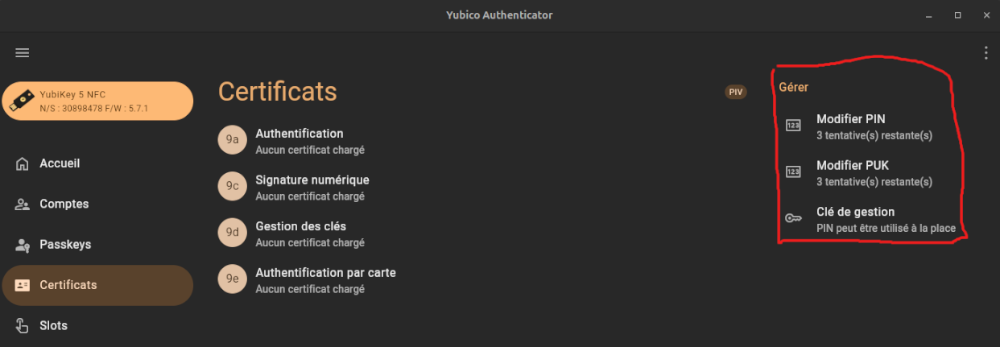

# Configuration Basique de votre Yubikey

## Prérequis

* Yubikey
* Poste de travail

## Étapes de mise en place

1. Installation des paquets de gestions sur votre poste de travail

```bash
sudo apt -y install \
  wget gnupg2 gnupg-agent dirmngr \
  cryptsetup scdaemon pcscd \
  yubikey-personalization yubikey-manager
```

### Configuration des informations par défaut

[Lien utile](https://www.gnupg.org/howtos/card-howto/en/ch03.html)

2. Brancher votre yubikey

```bash
# Vérifier si votre Yubikey est bien reconnue
ykman info
gpg --card-status

# Accès à la Yubikey via CLI
gpg --edit-card

# Changer le PIN et PUK et la clé de gestion
admin
passwd

# PIN par défaut: 123456
# PUK: 12345678
```

**Conseil :** Vous pouvez aussi configurer ces informations par défaut directement depuis l'interface graphique Yubico Authenticator dans l'onglet `Certificats`. [Lien de téléchargement](https://www.yubico.com/products/yubico-authenticator/)




[Continuer la configuration](./3_configuration_luks.md)