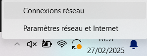
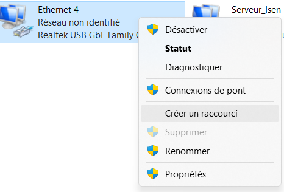
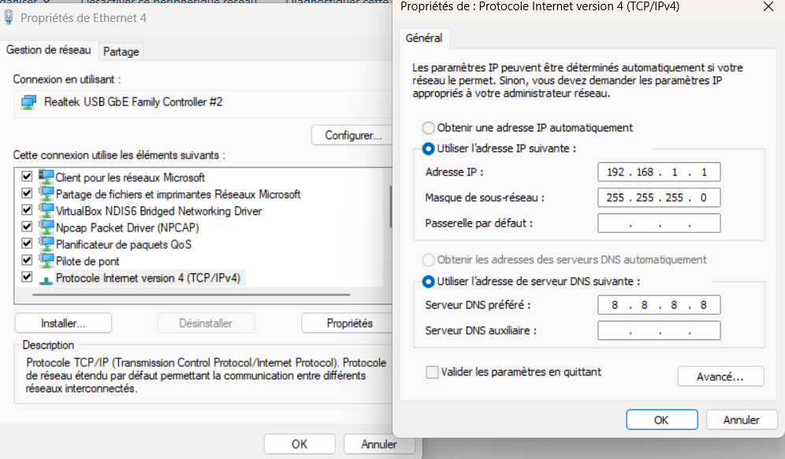

Ouvrir les connexions reseau avec click droit sur logo wifi  : 

Ensuite click droit sur l interface correspondante a la rasp :

Dans les proprietées double click sur ipv4 :

Mettre l'ip sous le meme reseau que la rasp
